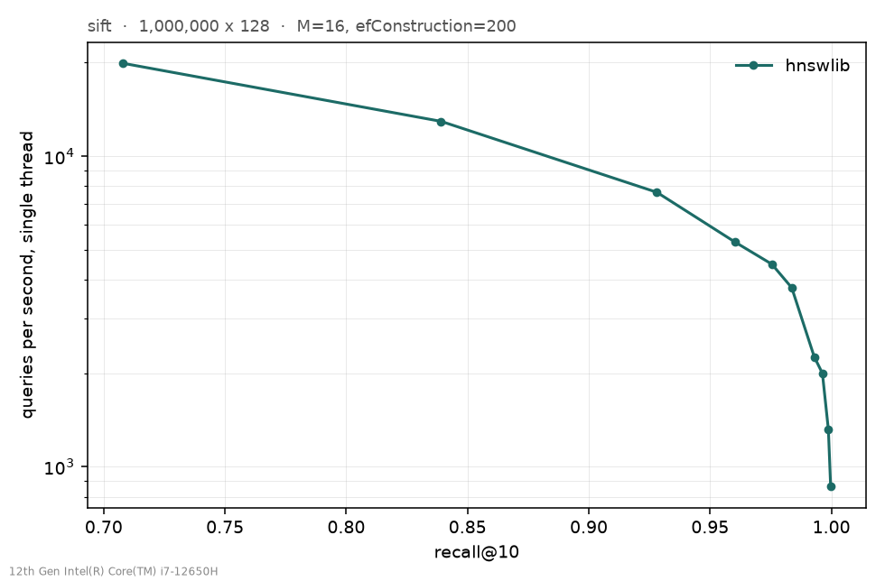

# fastvec

Vector similarity search engine, written from scratch in Go.

Implementing HNSW from the paper rather than calling a library, and benchmarking
it against hnswlib and FAISS on SIFT1M with everything running on a laptop CPU.

## Results

One million 128-dimensional vectors, single thread. Both implementations run
back to back in the same session on an idle machine.

    ef      fastvec recall / QPS      hnswlib recall / QPS      ratio
    10      0.7099 / 13079            0.7080 / 22858            1.75x
    60      0.9599 /  4109            0.9600 /  6282            1.53x
    100     0.9835 /  2656            0.9836 /  4234            1.59x
    500     0.9997 /   626            0.9997 /   937            1.50x

Recall matches to three or four decimal places at every point in the sweep, so
the graph this builds is as good as the reference implementation's. The gap is
execution speed, 1.5 to 1.75x.

Exact search over the same data does 12 queries/sec at recall 1.000, so the
index is around 220x faster than brute force at ef=100 for 1.6% of answers
differing.

### Build time

    fastvec   11m12s at   99% CPU  =  672 core-seconds
    hnswlib     83.1s at 1100% CPU  =  914 core-seconds

hnswlib is 8x faster on the clock because it inserts across eleven cores. Per
core this build does 26% less work than theirs, so the gap is parallelism rather
than inefficiency.

`BuildWorkers` inserts across goroutines and closes most of it: on SIFT-100k,
32.9s down to 3.79s, 8.7x. It costs 0.36 recall points, because a node inserted
while its neighbourhood is still half linked picks worse neighbours. Sequential
stays the default, since it is the only mode that produces the same index twice.

### Distance kernel

The distance function is hand-written AVX2 in Go assembly, since Go cannot emit
vector instructions from normal code. 6.4x on the kernel, 1.9x on a whole
search, recall unchanged. The gap between those two puts distance computation at
roughly 55% of search time before and 15% after.

Build with `-tags purego` to compile the assembly out and compare.

## What is implemented here

No third-party libraries on the query path. The `.fvecs` parser, distance
kernels, top-k heap, graph construction, search, and on-disk format are all in
this repository. hnswlib and FAISS appear only as benchmark opponents.

Go standard library only, plus CPU feature detection written by hand rather than
pulled from `golang.org/x/sys`.

## Running

    make test          # unit tests
    make bench         # HNSW on SIFT1M, sweeps ef, writes JSON
    make baseline      # hnswlib on the same data
    make plots         # draw both curves

Benchmarks reuse a saved index, so a re-measure costs seconds rather than the
11 minute build. Datasets are not in the repo; see `data/README.md`.

## Machine

Everything measured on one laptop: i7-12650H, 6 P-cores + 4 E-cores, 16 GB,
Ubuntu 24.04 on WSL2, Go 1.26.5. CPU only. Absolute numbers will differ
elsewhere; everything compared was run in the same session.

Full numbers in `docs/benchmarks.md`, reasoning in `docs/decisions.md`.

MIT licence.
